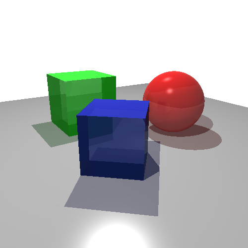
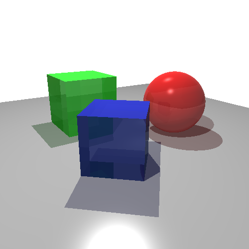

# Ray Tracing Shader

A fragment shader that implements a __height limited [ray tracer](https://en.wikipedia.org/wiki/Ray_tracing_(graphics))__ in the GLSL language.
The ray tracer computes the image by using the __perspective projection__ and the [__Phong reflection model__](https://en.wikipedia.org/wiki/Phong_reflection_model).
It renders a sphere of ruby and two cubes of emerald and sapphire over a floor of silver.

The ray tracer implements __translucent shadows__ and __photorealism__, by processing the reflectance and transmittance with the [__Fresnel equations__](https://en.wikipedia.org/wiki/Fresnel_equations).
As the GLSL language [__does not allow recursion__](https://www.khronos.org/registry/OpenGL/specs/gl/GLSLangSpec.4.60.html#function-definitions) in function calls, the ray tracer implements the recursion by using a [__binary heap__](https://en.wikipedia.org/wiki/Binary_heap).

The ray tracer first process each heap node by using a top-down approach, computing the color with the Phong model and the reflected and transmitted rays.
At the end, it reprocess all colors by using a bottom-up approach, merging the colors of the reflected and transmitted rays with the already processed color of the node.

## Sample images

The images present three levels of rendering quality of the ray tracer.
The __first__ shows the rendering with the heap of __height 3__, that is, with __7 nodes__.
The __second__ shows the rendering with the heap of __height 4__ (__15 nodes__).
The __last__ shows the rendering with the heap of __height 5__ (__31 nodes__).

The link to the shader working in WebGL follows right after each image.
The GPU usage increases as the number of heap nodes.

[Show in WebGL with heap size 7](https://santiagoviertel.github.io/ray-tracing-shader/7)

[Show in WebGL with heap size 15](https://santiagoviertel.github.io/ray-tracing-shader/15)

[Show in WebGL with heap size 31](https://santiagoviertel.github.io/ray-tracing-shader/31)

## Technical information

- __Platforms__: Linux and Windows __(not tested)__
- __Programming language__: GLSL and HTML
- __Last code change__: 03/14/2020