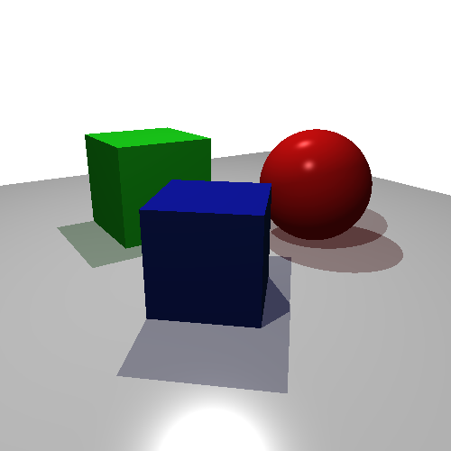

# Ray Tracing Shader

A fragment shader that implements a simple ray tracer.
The shader renders a sphere of ruby and two cubes of emerald and sapphire over a floor of silver.

__Things already done:__
- Perspective projection;
- Phong reflection model;
- Translucent shadows.

__Things to do:__
- Recursive ray tracing.

__Sample Image__

[Show with WebGL](https://santiagoviertel.github.io/ray-tracing-shader)

- __Platforms__: Linux and Windows __(not tested)__
- __Programming language__: GLSL and HTML
- __Last code change__: 03/05/2020